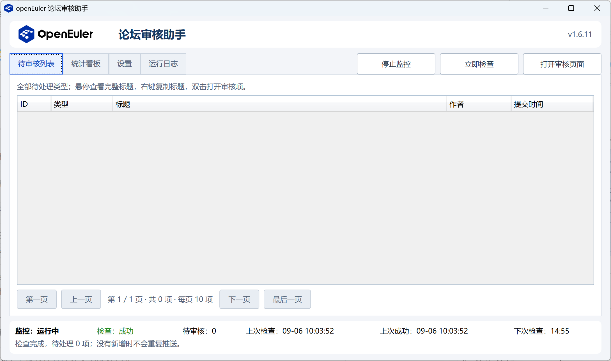
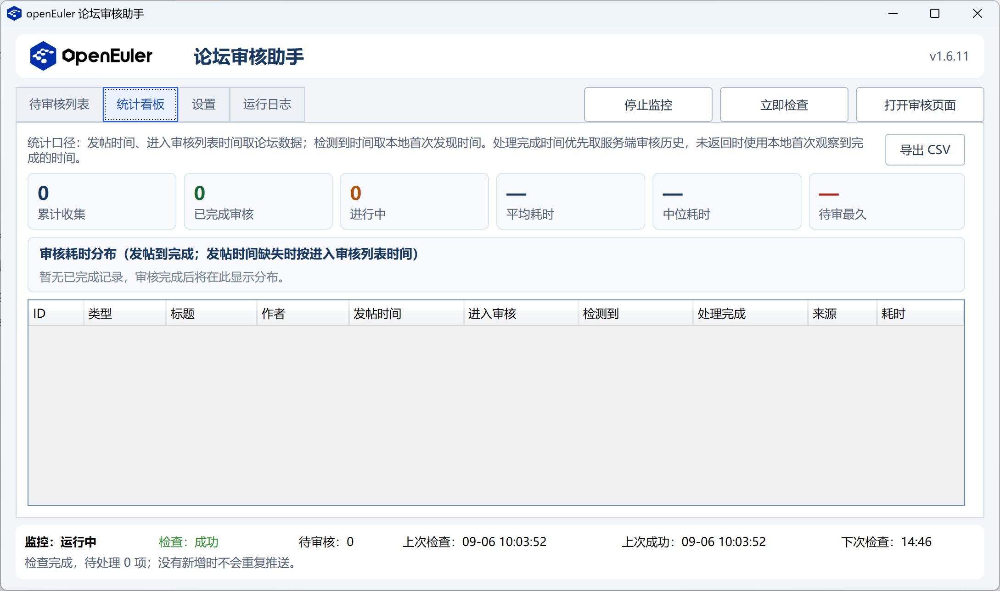
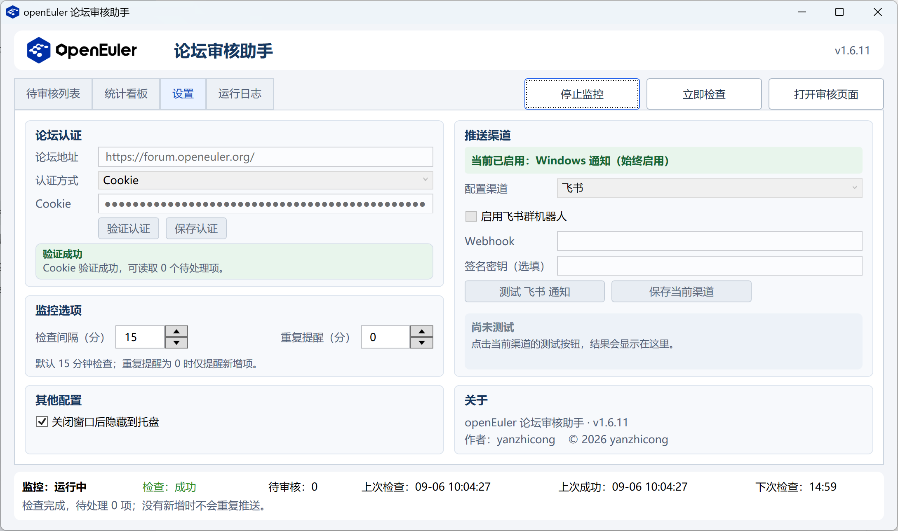
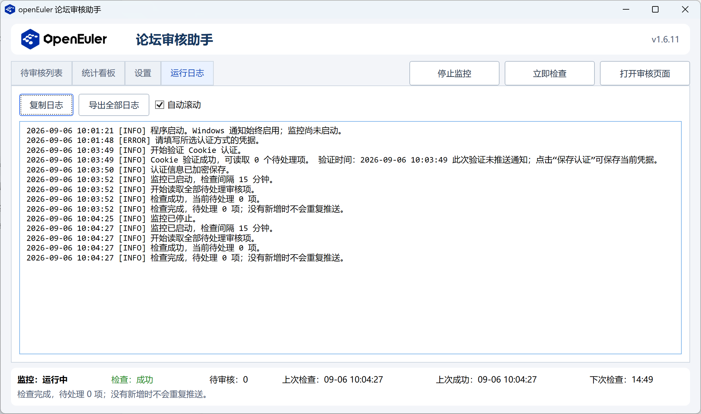

# openEuler 论坛审核助手

Windows x64 免安装的 openEuler 论坛待审核项监控工具。程序读取待审核列表，发现新增项时通过 Windows 通知和可选的群机器人渠道提醒；实际审核在浏览器中完成。

当前版本：v1.7.0

## 功能

- 支持 Cookie 或 API Key 认证，并可在程序内验证认证是否有效。
- 读取全部待审核类型；审核列表固定每页 10 条，支持首页、上一页、下一页和末页跳转。
- Windows 通知始终启用；可选企业微信、钉钉、飞书群机器人 Webhook，并支持单独测试当前渠道。
- 检查间隔和重复提醒支持鼠标箭头、键盘上下键调整，修改后立即生效并自动保存。
- 最小化到托盘、单实例运行、休眠恢复补查、可滚动日志、日志复制和导出。
- 统计看板记录发帖、进入审核、首次检测与处理完成时间，支持导出 CSV。
- 状态栏显示监控状态、检查结果、待审核数量、上次检查、上次成功和下次检查时间。

## 界面预览

### 待审核列表



### 统计看板



### 设置



### 运行日志



## 使用

1. 将发布目录放到当前用户有写入权限的位置，运行 `openEulerReviewMonitor.exe`，无需安装 .NET。
2. 在“设置”中填写论坛地址，并选择 Cookie 或 API Key。Cookie 必须填写完整的 `名称=值`，不要填写网页 URL、`Set-Cookie` 响应头或只有值的片段。
3. 点击“验证认证”。结果仅显示在页面中，不保存设置，也不会发送推送。
4. 需要时选择企业微信、钉钉或飞书，填写 Webhook 后启用并保存当前渠道。Windows 通知仍会同步保留。
5. 点击“启动监控”开始检查；运行中可直接修改检查间隔和重复提醒。默认每 15 分钟检查一次。

认证和推送配置需要先停止监控再修改；关闭窗口行为、检查间隔和重复提醒可直接修改并自动保存。默认点击 X 会隐藏到托盘，可在“其他配置”中改为直接退出。

## 监控规则

- 读取 `review.json?status=pending` 的完整分页，不限制审核类型。
- 仅在待处理项新增时通知；各渠道独立去重，重启后不会重复推送已通知项。
- 默认不重复提醒未处理项；重复提醒设为 0 时关闭。
- 检查失败会保留上次成功列表，状态栏显示失败；认证失效会额外提交一次 Windows 通知。
- 手动检查、定时检查、认证验证和推送测试互斥。下一次检查从本次检查及推送完成后开始计时。
- 同一台电脑使用全局互斥锁限制单实例。休眠、关机或注销期间不监控，休眠恢复后补查。

## 便携与数据

首次运行会在 EXE 旁创建 `data`：

- `settings.dat`：使用当前 Windows 用户的 DPAPI 加密，包含认证信息和 Webhook。
- `monitor-*.db`：SQLite 数据库，保存通知去重记录、提醒时间与审核统计数据。
- `logs/`：滚动日志，单文件约 5 MB，保留最近 30 天。

同一 Windows 用户在同一电脑内移动完整目录通常无需重新配置。迁移到其他电脑或 Windows 用户后需重新填写凭据。不要将程序放到 Program Files 等不可写位置。

旧版的 `state-*.json` 和 `stats-*.json` 会在首次运行时自动导入数据库，并改名为 `.migrated` 备份。

## 编译与测试

安装 .NET 10 SDK 后，在项目目录执行：

```powershell
dotnet build -c Release
dotnet run --project Tests/Tests.csproj -c Release
./publish.ps1
```

发布产物位于 `dist/win-x64`。项目使用 `Microsoft.Data.Sqlite` 管理本地统计与去重数据；自动化测试使用模拟 HTTP 响应，不访问真实论坛或发送群消息。

## 版本历史

### v1.7.0

- 使用 SQLite 保存审核统计、推送去重和提醒时间；旧 JSON 数据首次运行时自动迁移并保留备份。
- 新增统计看板，展示发帖、进入审核、首次检测和处理完成时间，以及审核耗时分布。
- 处理完成时间优先关联服务端审核历史，未返回时明确标记为本地观察时间。
- 支持导出全部统计记录为 UTF-8 CSV。

### v1.6

- 合并为“待审核列表 / 设置 / 运行日志”三页；页签和主操作按钮统一在顶部一行。
- 启动和停止合并为同一按钮；设置页加入其他配置和关于信息。
- 优化各配置区的固定布局、对齐、间距和状态颜色。

### v1.5

- 审核列表固定每页 10 条；日志恢复为可滚动连续文本。
- 推送渠道改为下拉选择，支持 Windows、企业微信、钉钉和飞书。
- 增加页内认证与推送结果提示、时间输入箭头和托盘行为设置。

### v1.2

- 测试按钮移入渠道配置区；测试和认证结果均采用页内提示。
- 使用官方 openEuler 横版 Logo 与应用图标。

## 参考接口

- Discourse 审核队列：https://github.com/discourse/discourse/blob/main/app/controllers/reviewables_controller.rb
- 飞书自定义机器人：https://open.feishu.cn/document/client-docs/bot-v3/add-custom-bot
- 钉钉自定义机器人：https://open.dingtalk.com/document/orgapp/custom-robot-access
- 企业微信群机器人：https://developer.work.weixin.qq.com/document/path/91770

作者：yanzhicong
© 2026 yanzhicong
